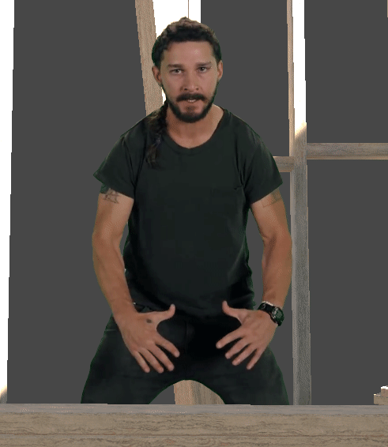
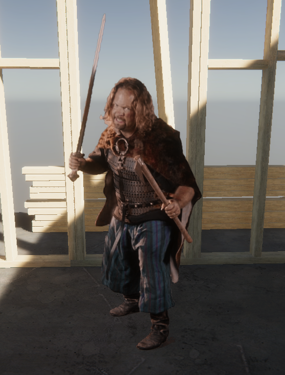
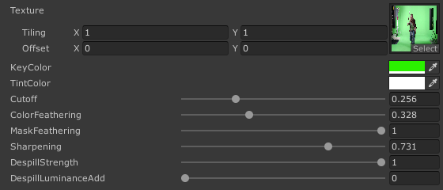
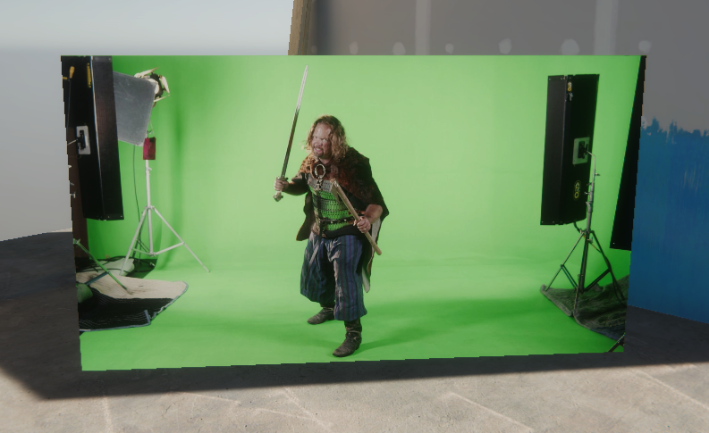
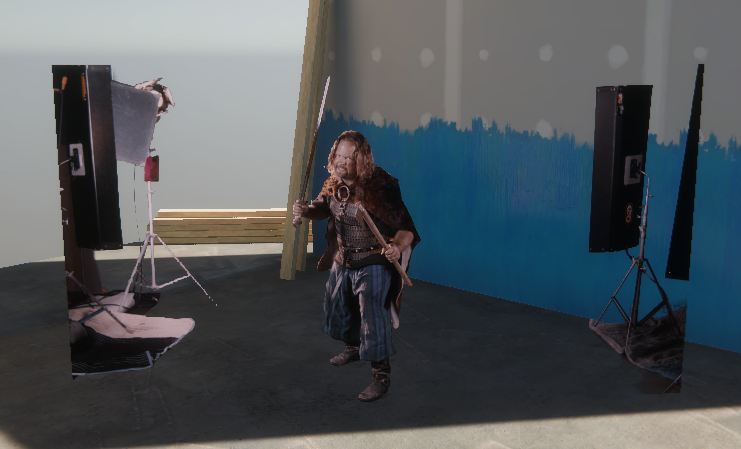
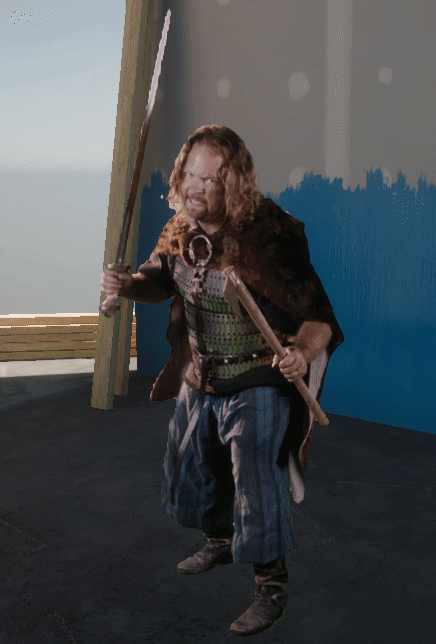

# UnityChromakey
*Disclaimer: Unity has changed a lot since I originally implemented this simple shader, it may no longer work as intended in all render pipelines and conditions.*

A simple, yet powerful chromakey / greenscreen solution for Unity. Designed to be used with virtual production.

## Usage
**This shader works in HDRP & URP**

Once you've got the files in your project: Assign the chromakey shader to a material of your choice and attach that material to a quad / plane. Provide an image to the material or use a VideoPlayer to feed an image in. 

**Why this approach?** It is the most verstile. Screenspace effects are complicated, clunky and difficult to modify. Screenspace effects also cannot be placed in worldspace easily. This shader is simple, only a few hundred lines and *is a single pass*. It is excellent for quickly blocking out greenscreen footage or even final composites.
This repository is *not* an entire project. You don't need all my project cruft *yuck*. This is simply a few files you can toss into your project and *actually use*.

## Features
* **Standard Chromakeying:** (*green screen only*). Modification would be required to work with a bluescreen (Would require Despill algorithm changes)
* **Simple edge feathering:** This is a single-pixel blur approach, but enough for 99% of shots (when do you actually need a crazy 15 pixel deep blur?!?). I will probably expand the kernel to a larger box blur in the future.
* **Simple edge sharpening:** (Sharpen up blurred edges to give a more anti-aliased feeling as opposed to just blur)
* **Despill correction:** Getting rid of that pesky green light bleed
* Simple usage, only a single shader and a single-pass
* Example presets you can load onto the material (for the existing examples)

## Examples

**Note:** Have mercy on the GIF compression and the fact that this footage was downloaded from YouTube, so it already has compression artifacts within it. It would look *considerably* better with nice clean source footage.

**Note:** This is an example of Despill correction being toggled. Watch the edges for green.

**Note:** This is *reflective* armor. Reflective. The nightmare for greenscreen. Looks pretty good to me!

Here are the controls used to tune for the following images:

**Note:** This is me controlling the strength of the Despill correction.

**Example of really poor greenscreen situation + DSLR as webcam:**

## Modification
You are free to modify and improve on this simple approach. I suggest creating a pull request with your changes!

## Primary sources in the creation of this tool
http://gc-films.com/chromakey.html

https://benmcewan.com/blog/2018/05/20/understanding-despill-algorithms/

## Disclaimers
Example images are random and off the internet. They are not mine and I don't pretend they are.

This shader hasn't been heavily optimized yet, but appears to perform quite well. It is untested on mobile platforms, but theoretically should work.

